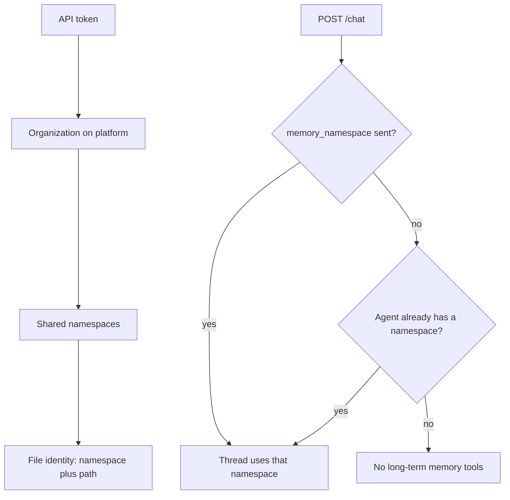

The Cominty API is a standard HTTPS/JSON API for chatting with agents,
managing conversation threads, handling file uploads/downloads and message
exports, and storing memory files in named namespaces. Every endpoint below is
called by the [Python SDK](/sdk/overview). Use the SDK for the smoothest
experience, or call them directly.

## Base URL

```text
https://ds.cominty.com
```

## Authentication

Send your API token in the `x-cominty-token` header on every request. Create a
token on the **API keys** page at
[platform.cominty.ai](https://platform.cominty.ai).

```bash
curl "https://ds.cominty.com/chat?user_id=$COMINTY_USER_ID" \
  -H "x-cominty-token: $COMINTY_API_KEY"
```

A key created now starts with `sk-cmt-`. Paste it into the header exactly as
you received it, with or without a single `Bearer ` in front. Both forms work:

```text
x-cominty-token: sk-cmt-...
x-cominty-token: Bearer sk-cmt-...
```

The secret is shown once, when you create the key. Copy it then. A key created
before the prefix existed has no `sk-cmt-` and keeps working when sent as is.

<Warning>
  `SK-CMT-` (wrong case), and `bearer` or a double space after `Bearer` are all rejected.
  If your client adds the prefix itself, add it only when the stored value does
  not already start with `sk-cmt-`.
</Warning>

### Authentication errors

| Status | `detail` | Meaning |
| ------ | -------- | ------- |
| `403` | Starts with `Invalid COMINTY_API_KEY. A Cominty Platform secret starts with 'sk-cmt-'.` | The secret is wrong: tampered, truncated, empty, or a key from another vendor (OpenAI, Anthropic) or a session token. |
| `403` | `Unauthorized` | The key was archived. Create a new key instead of retrying the same one. |
| `403` | `Invalid token` | You sent the key in `Authorization`, which is not the key header. Send the same value in `x-cominty-token`. |

<Note>
  Chat and threads are scoped to one end user via `user_id`. Chat start sends
  it in the body (`options.user_id`). Thread endpoints send it as a query
  parameter. The SDK fills this in from the client, so you never pass it on
  those calls. Memory endpoints may accept `user_id` as an optional query, but
  it does not select a memory namespace. See
  [Memory on the platform](#memory-on-the-platform).
</Note>

## Endpoints

| Method & path | Purpose |
| ------------- | ------- |
| `POST /chat` | Start a thread and post the first message |
| `POST /chat/{thread_id}` | Post a follow-up message in a thread |
| `GET /chat/messages/{message_id}/stream` | Stream an assistant reply's progress (JSONL) |
| `POST /chat/messages/{message_id}/cancel` | Cancel an in-flight message |
| `GET /chat/messages/{message_id}/export` | Export a message as a file (`pdf` or `docx`) |
| `GET /chat/files/upload` | Get a presigned upload permission for a new file |
| `POST /chat/files` | Confirm an upload, registering the file |
| `GET /chat/files/{file_pid}` | Get a presigned download URL for a conversation file |
| `GET /chat` | List threads |
| `GET /chat/{thread_id}` | Get a thread with its full message history |
| `PUT /chat/{thread_id}` | Update a thread (rename, star) |
| `DELETE /chat/{thread_id}` | Archive a thread |
| `GET /memory` | List memory files (summaries, no content) |
| `GET /memory/namespaces` | List namespace names that contain at least one file |
| `POST /memory` | Create a memory file |
| `GET /memory/file` | Get a memory file, including content |
| `PUT /memory/file` | Partially update a memory file's content/purpose |
| `DELETE /memory/file` | Delete a memory file |

<Warning>
  Response shapes differ per endpoint. `POST /chat` returns a full **thread**,
  but `POST /chat/{id}` returns a bare **message**. `GET /chat/{id}` returns a
  full thread, but `PUT /chat/{id}` returns a **summary** with no messages.
  `GET /memory` returns file **summaries** with no `content`; `GET /memory/file`,
  `POST /memory`, and `PUT /memory/file` all return the full file. Check each
  endpoint page for its exact response.
</Warning>

## Memory on the platform

A memory file belongs to one namespace. The file's identity is the pair
`(namespace, path)`. The same path in two namespaces is two files. Namespaces
are shared across the organization for your API token. There is no endpoint
to create or delete a namespace: the first successful `POST /memory` in a new
name creates it, and `GET /memory/namespaces` drops the name once it has no
files left.



The endpoint pages list `namespace` as optional (max 128 characters). On the
platform API it is required for create, get, update, and delete: omit it and
the call returns **400** `Missing namespace`.

| Call | `namespace` omitted | `namespace` set |
| ---- | ------------------- | --------------- |
| `POST /memory`, `GET /memory/file`, `PUT /memory/file`, `DELETE /memory/file` | **400** `Missing namespace` | That namespace |
| `GET /memory` | Every file in the organization | Files in that namespace only |
| `GET /memory/namespaces` | Every name that already has a file | - |

`POST /memory` sends `namespace` in the JSON body, next to `path`, `purpose`,
and `content`. The other memory calls send it as a query parameter. `user_id`
may still appear as an optional query. It does not choose the namespace. A
`user_id` in the body of `POST /memory` is ignored, with no error.

`GET /memory` returns the most recently updated files first. Without
`namespace`, the same `path` can appear in several namespaces, so key a file by
`(namespace, path)`. `GET /memory/namespaces` returns unique names in no
guaranteed order. Neither call has a pagination or sort parameter.

Limits that still apply: `purpose` is trimmed and must be 1 to 100 characters,
`content` is at most 1 MiB, and a file named `User.md` has a shorter content
limit.

`POST /chat` accepts `options.memory_namespace` (max 128 characters). If you
send it, the thread uses that namespace for its whole life. If you omit it
and the agent already has a namespace configured on the platform, the thread
uses that default. Otherwise the thread runs with no long-term memory tools.
`POST /chat/{thread_id}` has no `memory_namespace` field. A value sent there
is ignored. Start a new thread to switch namespaces. Thread responses do not
echo the name: keep the value you sent at start.

You cannot force "no memory" on an agent that already has a namespace. Omitting
`options.memory_namespace` uses that default. When you send a value on
`POST /chat`, it wins over the agent's. A thread with no namespace at all runs
normally, and no field or event says that memory tools are off.

A namespace is shared by everyone in the organization who uses it. `user_id`
is not part of the scope. To isolate end users, put an identifier in the name
yourself, for example `support-bot-user_123`. A namespace is not a security
boundary between agents: do not store a secret that only one agent should see.

<Warning>
  `path` (in `POST /memory`'s body, and as a query parameter everywhere else)
  may have **at most one folder segment**. `"notes/todo.md"` is fine,
  `"a/b/todo.md"` returns **422** (`"Maximum folder depth is 1"`). `content`
  may be an empty string. There's no minimum length.
</Warning>

<Warning>
  `PUT /memory/file` requires a `version` query parameter: the opaque token
  from your last read of that file. A stale `version` (the file changed since
  you read it) returns **409 Conflict**. A malformed one (not a real timestamp)
  returns **422** instead. Round-trip it unchanged. Do not parse or compare it.
</Warning>

<Warning>
  `PUT /memory/file`'s body accepts `content`/`purpose` as `null`, but sending
  `null` currently has no effect: the existing value is left untouched (same
  as omitting the key), the `version` doesn't change either, and the request
  still returns 200. There is currently no way to clear either field once set.
</Warning>

<Warning>
  `DELETE /memory/file` is **not idempotent**: deleting an already-deleted (or
  never-existing) path returns **404**, not a repeated 204.
</Warning>

<Note>
  After a migration, `GET /memory/namespaces` can still return stored names
  such as `user_abc::default`. These hold the files written before namespaces
  existed, one per former user. Pass that exact string back. Do not assume the
  files now live in a namespace called `default`. Conversations that were
  already running keep reading that namespace. A new conversation has no memory
  until it gets a `memory_namespace`.
</Note>

## Capping tool rounds

`POST /chat` and `POST /chat/{thread_id}` accept `options.max_steps`: the
maximum number of tool rounds the agent runs for **that message**. Send an
integer `>= 1`. Omit it and the server applies its default (60 today, and it
may change). The SDK exposes it as [`max_steps`](/sdk/max-steps).

<Warning>
  The cap is **per message**, not per thread. A follow-up without `max_steps`
  runs with the server default, not the value of the previous message. Send it
  on every message to keep a custom cap. The value is not stored and not
  returned.
</Warning>

- Reaching the cap is not an error. The message ends with `status` `success`,
  `error_code` `null`, and a reply that asks whether to continue. No field or
  event flags it, and the wording is written by the model, so do not parse it.
  Continue with `POST /chat/{thread_id}`.
- It is an order of magnitude, not an exact count. The agent can run up to
  `max_steps + 1` rounds, one round can contain several tool calls, and each
  sub-agent has its own budget. It limits rounds, not tokens, cost, or time.
- `null` returns **422** `int_type`. A value below 1 returns **422**
  `greater_than_equal`. A float or a non-numeric string returns **422**
  (`int_from_float`, `int_parsing`). Always send a JSON integer. No thread or
  message is created when the request is rejected.

## Files and exports

<Warning>
  Uploading a file is a **3-step flow**, not a single call:

  1. `GET /chat/files/upload`: get a presigned upload permission (`url` +
     `fields`) for your `filename`/`mimetype`.
  2. Upload the file directly to that `url` (a storage host, not
     `ds.cominty.com`) as a `multipart/form-data` POST, including `fields` as
     form fields alongside the file. **Don't send `x-cominty-token` to this
     URL**. It's a different host and doesn't expect it.
  3. `POST /chat/files` with the resulting `ETag` (as `etag`) and the `key`
     from step 1's `fields`, to register the file and get back a
     `ConversationFile`. Its `id` is what feeds `file_ids` on `POST /chat`
     or `POST /chat/{thread_id}`.
</Warning>

<Warning>
  `GET /chat/files/{file_pid}` doesn't return file bytes. It returns a
  presigned **download URL** as a bare JSON string. Fetch that URL directly
  (again, no `x-cominty-token` needed there) to get the actual content.
</Warning>

<Warning>
  `GET /chat/messages/{message_id}/export` returns the exported file's raw
  bytes (a PDF or DOCX), not JSON. The response `content-type` shown on this
  page is a placeholder from the spec, not what you'll actually receive.
</Warning>

Each endpoint page below includes a live playground. Add your token and try a
real request.
