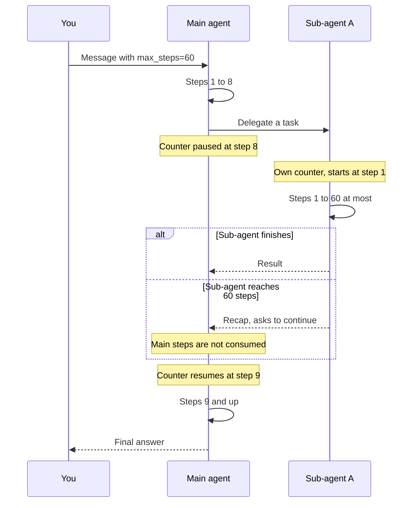

An agent works in **tool rounds**, also called **steps**. The model picks one
or more tools (web search, file write, and so on), the tools run, and the cycle
repeats until the agent can answer. Long tasks can chain many steps, which
costs time and money. `max_steps` caps the number of steps for **one message**.

Reaching the cap is **not an error**. The agent stops using tools, writes a
short recap, and asks whether it should continue. The message ends with
`status` set to `success`. You continue with a normal follow-up in the same
thread.

This guide works the same with the [Python SDK](/sdk/reference#max_steps) and
the [HTTP API](/api-reference#tool-round-cap).

<Note>
  `max_steps` is available through the API and the SDK. It is not yet exposed
  in the Portal or in the Platform Playground.
</Note>

## Set a cap

Send `max_steps` as an integer `>= 1` with the start request or with a
follow-up. If you omit it, the server applies its default. Today the default is
60 for every agent (Hive, Chat, Planner, and custom agents), and it may change.

<Tabs>
  <Tab title="Python SDK">
    ```python
    run = await client.chat.start(
        agent_id="agt_1",
        message="Find the release date of Python 3.13",
        max_steps=5,
    )
    print(await run.text())
    ```
  </Tab>
  <Tab title="HTTP">
    ```bash
    curl -X POST "https://ds.cominty.com/chat" \
      -H "x-cominty-token: $COMINTY_API_KEY" \
      -H "Content-Type: application/json" \
      -d '{
        "message": {"content": "Find the release date of Python 3.13"},
        "options": {
          "agent_id": "agt_1",
          "user_id": "'"$COMINTY_USER_ID"'",
          "max_steps": 5
        }
      }'
    ```
  </Tab>
</Tabs>

There is no "unlimited" value, and there is no upper bound. A very high value
such as `999` effectively removes the cap, but see
[the budget warning](#a-high-cap-does-not-protect-your-budget).

## What counts as a step

One step is one tool round: the model is called, it asks for one or more tools,
and those tools run. The final answer, written without tools, is not a step.

- The limit is checked after each round, so an agent can run up to
  `max_steps + 1` rounds.
- One round can contain several tool calls. `max_steps` is an order of
  magnitude, not an exact count of tool calls.
- It limits rounds, not tokens, cost, or duration. A single round can still be
  long or expensive.

## Sub-agents have their own step counter

When an agent calls a sub-agent, `max_steps` applies **to each agent
independently**, not globally.

- The **main agent** pauses its counter while it waits for the sub-agent.
- The **sub-agent** gets its own full quota of steps, up to `max_steps` (or the
  default).
- When a sub-agent reaches its limit, it asks the main agent (or you) to
  continue. This does not consume the main agent's steps.

Example with `max_steps=60`: the main agent is at step 8 and calls Sub-agent A.
Sub-agent A can run up to 60 steps on its own. Once it finishes, control returns
to the main agent, which resumes at step 9.



| Agent | Counter | Limit |
| ----- | ------- | ----- |
| Main agent | Steps 1 to 8, paused during the delegation, resumes at 9 | `max_steps` |
| Sub-agent A | Steps 1 to 60, independent of the main agent | `max_steps` |

<Warning>
  Because each sub-agent has its own counter, one message can run far more than
  `max_steps` steps in total. Set a lower `max_steps` when your agents delegate
  a lot.
</Warning>

## Limits and gotchas

### The cap is per message, not per thread

A follow-up that does not pass `max_steps` runs with the server default,
whatever the first message used. Pass an integer on every message to keep a
custom cap.

<Tabs>
  <Tab title="Python SDK">
    ```python
    run = await client.chat.start(
        agent_id=AGENT_ID,
        message="Research X, then write it up.",
        max_steps=5,
    )
    await run.text()  # recap, asks whether to continue

    reply = await client.chat.send(
        run.thread.id,
        agent_id=AGENT_ID,
        message="Yes, continue.",
        max_steps=5,
    )
    print(await reply.text())
    ```
  </Tab>
  <Tab title="HTTP">
    ```bash
    curl -X POST "https://ds.cominty.com/chat/$THREAD_ID" \
      -H "x-cominty-token: $COMINTY_API_KEY" \
      -H "Content-Type: application/json" \
      -d '{
        "message": {"content": "Yes, continue."},
        "options": {"agent_id": "agt_1", "max_steps": 5}
      }'
    ```
  </Tab>
</Tabs>

### Hitting the cap looks like a normal success

- The reply ends with `status` set to `success` and `error_code` set to `null`.
- No field, event, or error code tells you the cap was reached.
- The recap is written by the model in the conversation language. Do not parse
  it.

### A high cap does not protect your budget

The budget is checked **once**, when the agent starts. The cost of the run is
computed and deducted **at the end** of its execution, not while it runs. An
agent started on an expensive model with a very high `max_steps` can spend well
beyond your intended budget before anything stops it. Choose a cap that matches
the cost you can accept.

### The value is not readable afterwards

The value is neither stored nor returned for chats. Keep it on your side if you
need to display it.

## Invalid values

Always send a JSON integer `>= 1`. Nothing is created when a request is
rejected.

| Value sent | HTTP API | Python SDK |
| ---------- | -------- | ---------- |
| `null` | 422 `int_type` | `InvalidParams` |
| Below 1 | 422 `greater_than_equal` | `InvalidParams` |
| A float | 422 `int_from_float` | `InvalidParams` |
| A non-numeric string | 422 `int_parsing` | `InvalidParams` |

## Scope

- `max_steps` exists on `POST /chat` and `POST /chat/{thread_id}`, and on
  `chat.start` and `chat.send` in the SDK.
- Routines also accept `max_steps` on the platform, but the SDK and the public
  API reference do not cover routines.
- Agents have no `max_steps` setting. Each message carries its own value.
- The default is a server setting. Pass an integer if your integration depends
  on an exact value.

## Next steps

<CardGroup cols={2}>
  <Card title="API reference" icon="code" href="/api-reference#tool-round-cap">
    `options.max_steps` on the chat endpoints.
  </Card>
  <Card title="Python SDK reference" icon="book" href="/sdk/reference#max_steps">
    The `max_steps` argument, `MaxSteps`, and `SERVER_DEFAULT`.
  </Card>
</CardGroup>
