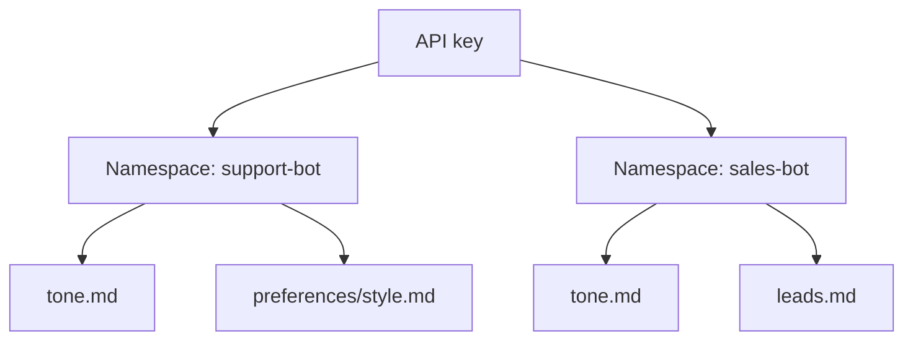
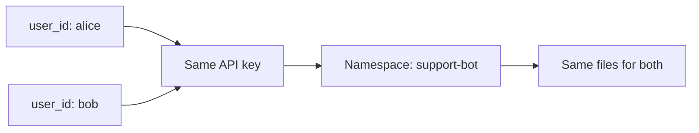
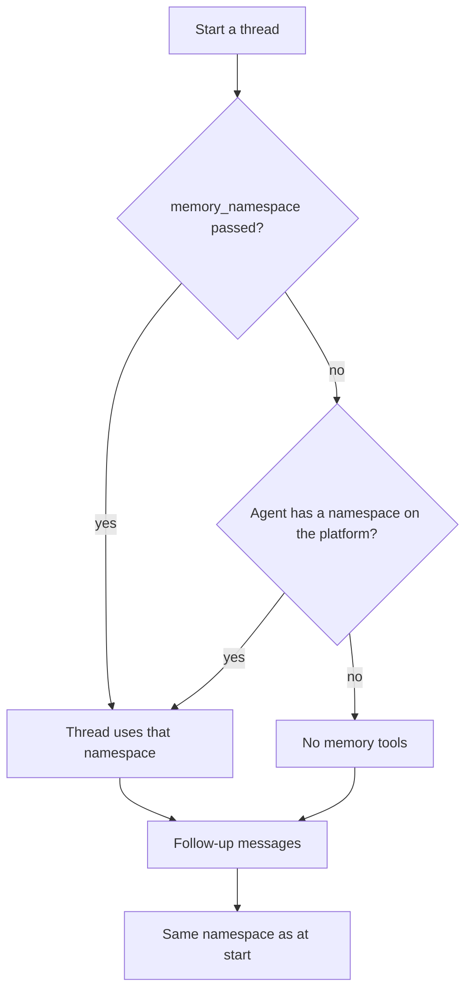
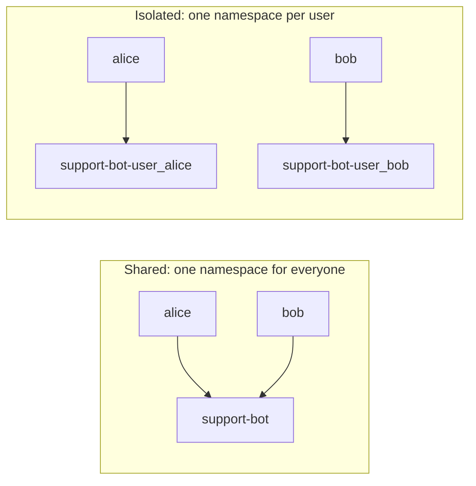

Agents can read and write **memory files** that outlive a conversation. A
**namespace** is the bag those files live in. You choose its name.

This guide explains the concept. It works the same with the
[Python SDK](/sdk/quickstart#store-and-recall-a-memory-file) and the
[HTTP API](/api-reference).

## How namespaces work

Each memory file lives in exactly one namespace. The identity of a file is the
pair `(namespace, path)`. The same path can exist in two namespaces, and a
write in one does not touch the other.



Here `tone.md` exists twice. `("support-bot", "tone.md")` and
`("sales-bot", "tone.md")` are two different files.

- Namespaces are shared across your organization for your API key. They are
  visible to every `user_id` that key acts for.
- `user_id` plays no role in scoping memory. Two clients with the same key and
  different `user_id` values see the same files.
- There is no call to create or delete a namespace. The first file you create
  in a new name brings it into existence. It disappears when its last file is
  deleted.



## Manage memory files

A memory file has a `path`, a `purpose`, and a `content`.

| Field | Meaning |
| ----- | ------- |
| `path` | Name of the file. At most one folder segment: `tone.md` and `preferences/tone.md` are valid, `a/b/tone.md` is not. |
| `purpose` | Why the file exists. The agent reads it. 1 to 100 characters after trimming. |
| `content` | The body. Up to 1 MiB. An empty string is allowed. `User.md` has a shorter limit. |
| `version` | An opaque token returned on every read. Send it back unchanged on the next write. |

<Tabs>
  <Tab title="Python SDK">
    ```python
    created = await client.memory.create(
        path="tone.md",
        namespace="support-bot",
        purpose="writing style",
        content="Keep it casual.",
    )

    summaries = await client.memory.list(namespace="support-bot")  # no content
    names = await client.memory.list_namespaces()
    fetched = await client.memory.get("tone.md", namespace="support-bot")
    ```
  </Tab>
  <Tab title="HTTP">
    ```bash
    curl -X POST "https://ds.cominty.com/memory" \
      -H "x-cominty-token: $COMINTY_API_KEY" \
      -H "Content-Type: application/json" \
      -d '{
        "namespace": "support-bot",
        "path": "tone.md",
        "purpose": "writing style",
        "content": "Keep it casual."
      }'

    curl "https://ds.cominty.com/memory/file?namespace=support-bot&path=tone.md" \
      -H "x-cominty-token: $COMINTY_API_KEY"
    ```
  </Tab>
</Tabs>

Listing returns the most recently updated files first, without `content`.
Without a namespace filter, the same `path` can appear several times, so always
key a file by `(namespace, path)`. There is no pagination or sort option.

### Update and delete

- **Updates are partial.** Send at least one of `content` or `purpose`. Omitted
  fields stay as they are.
- **You cannot clear a field.** Sending `null` has no effect. Omit the field
  to keep it.
- **`version` protects against concurrent writes.** A stale `version` is
  rejected with a conflict (HTTP 409). Read the file again and retry. A
  malformed `version` returns 422.
- **Delete is not idempotent.** Deleting a file that is already gone returns
  404.

<Tabs>
  <Tab title="Python SDK">
    ```python
    from cominty_sdk import ConflictError

    updated = await client.memory.update(
        "tone.md",
        namespace="support-bot",
        version=fetched.version,
        content="Keep it upbeat.",
    )

    try:
        await client.memory.update(
            "tone.md",
            namespace="support-bot",
            version=fetched.version,  # stale
            content="this write is rejected",
        )
    except ConflictError:
        fetched = await client.memory.get("tone.md", namespace="support-bot")

    await client.memory.delete("tone.md", namespace="support-bot")
    ```
  </Tab>
  <Tab title="HTTP">
    ```bash
    curl -X PUT "https://ds.cominty.com/memory/file?namespace=support-bot&path=tone.md&version=$VERSION" \
      -H "x-cominty-token: $COMINTY_API_KEY" \
      -H "Content-Type: application/json" \
      -d '{"content": "Keep it upbeat."}'

    curl -X DELETE "https://ds.cominty.com/memory/file?namespace=support-bot&path=tone.md" \
      -H "x-cominty-token: $COMINTY_API_KEY"
    ```
  </Tab>
</Tabs>

## Attach a thread to a namespace

A thread only uses memory if it is attached to a namespace when it starts.
Pass `memory_namespace` on the start request. The value is frozen for the whole
life of the thread. Follow-up messages do not accept it.



<Tabs>
  <Tab title="Python SDK">
    ```python
    run = await client.chat.start(
        agent_id="agt_1",
        message="Use the tone file.",
        memory_namespace="support-bot",
    )

    # Same thread, same namespace. Do not pass memory_namespace.
    await client.chat.send(run.thread.id, agent_id="agt_1", message="Again, shorter.")
    ```
  </Tab>
  <Tab title="HTTP">
    ```bash
    curl -X POST "https://ds.cominty.com/chat" \
      -H "x-cominty-token: $COMINTY_API_KEY" \
      -H "Content-Type: application/json" \
      -d '{
        "message": {"content": "Use the tone file."},
        "options": {
          "agent_id": "agt_1",
          "user_id": "'"$COMINTY_USER_ID"'",
          "memory_namespace": "support-bot"
        }
      }'
    ```
  </Tab>
</Tabs>

Keep in mind:

- To switch namespaces, start a new thread.
- Thread responses do not echo the namespace. Keep the name you sent.
- If you omit `memory_namespace` and the agent has no namespace configured on
  the platform, the thread runs normally with no memory tools. Nothing tells
  you that memory is off. Pass it on every start where you expect memory.
- You cannot force "no memory" on an agent that already has a namespace. A
  value you send at start always wins over the agent's.

## Isolate your users

A namespace is shared by everyone in the organization who uses it. To keep end
users apart, put an identifier in the name yourself.



```python
namespace = f"support-bot-{client.user_id}"
```

<Warning>
  A namespace is not a security boundary between agents. Any agent of your
  organization started with that name can read and write it. Do not store a
  secret that only one agent should see.
</Warning>

## Limits

- `namespace` is a string of at most 128 characters. It is not trimmed.
- Omitting `namespace` on create, get, update, or delete returns 400
  `Missing namespace` on the platform.
- Listing without a filter returns every file in your organization.

## Files written before namespaces existed

Memory used to be scoped to each `user_id`. Those files are kept. They now sit
in a namespace named `{user_id}::default`, one per former user. Pass that exact
string as `namespace` to read them, or copy them to a namespace you choose.

Threads that were already running keep reading that namespace. A new thread has
no memory until you pass `memory_namespace`.

## Next steps

<CardGroup cols={2}>
  <Card title="API reference" icon="code" href="/api-reference">
    Memory endpoints, with a live playground.
  </Card>
  <Card title="Python SDK reference" icon="book" href="/sdk/reference#clientmemory">
    Signatures and local validation rules for `client.memory`.
  </Card>
</CardGroup>
