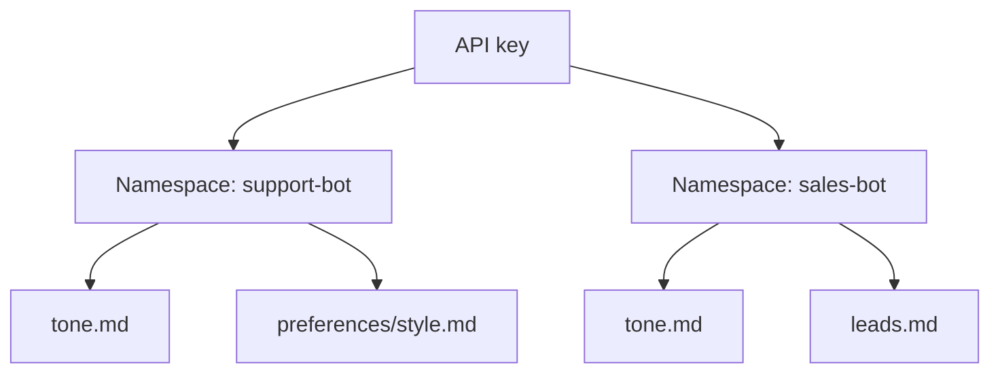
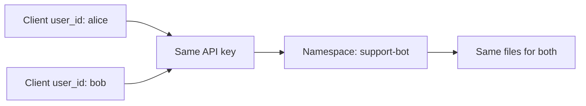
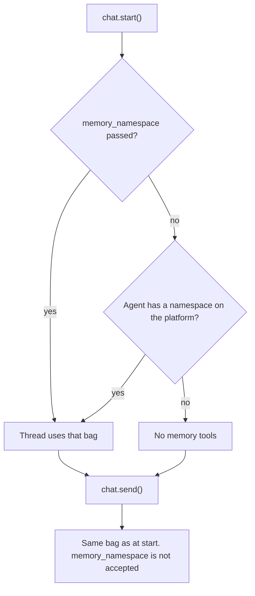
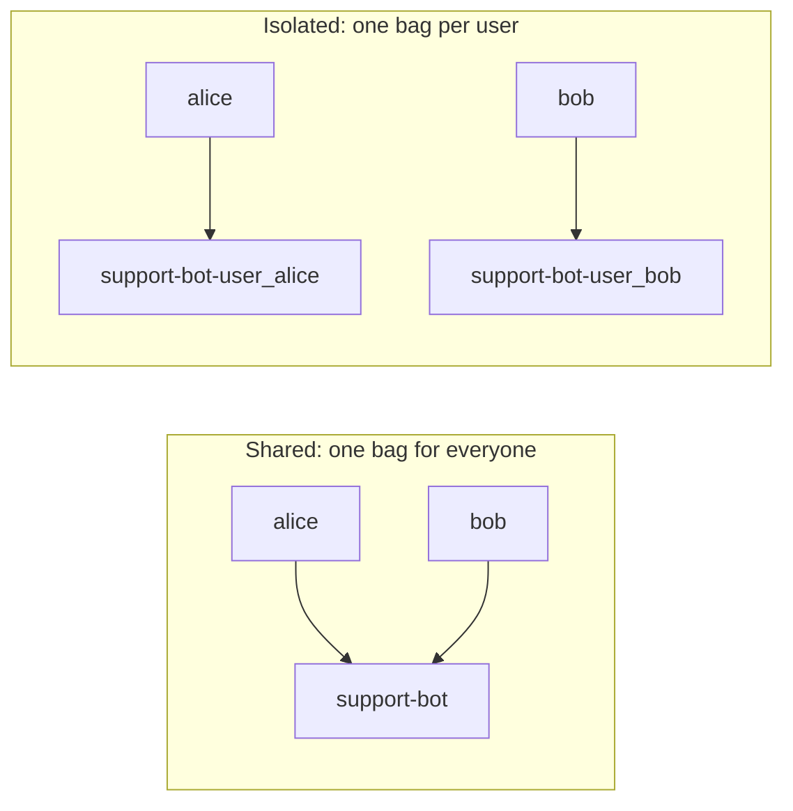

A **namespace** is a bag name you choose. Each memory file lives in exactly one
bag. The identity of a file is the pair `(namespace, path)`: the same path can
exist in two bags, and a write in one bag does not see the other.



Here `tone.md` exists twice. `("support-bot", "tone.md")` and
`("sales-bot", "tone.md")` are two different files.

Bags are visible to the API key, across every `user_id` that key acts for. Two
clients built with the same key and different `user_id` values share the same
memory files. `client.memory` does not send `user_id`. Chat and threads still
use the client's `user_id`.



There is no `create_namespace` call. The first successful `create()` against a
new name brings that bag into existence. `list_namespaces()` then includes the
name. `get` and `delete` on a path that is not in that bag raise
`NotFoundError`. They do not create the bag.

For the HTTP contract, see [Memory on the platform](/api-reference#memory-on-the-platform).
For every signature, see [`client.memory`](/sdk/reference#clientmemory).

## Create, list, and read

`namespace` is required on `create`, `get`, `update`, and `delete`. Omitting it
is a `TypeError`. `list()` with no filter returns every file visible to this
API key. Pass `namespace=` to keep one bag.

```python
namespace = "support-bot"

created = await client.memory.create(
    path="tone.md",
    namespace=namespace,
    purpose="writing style",
    content="Keep it casual.",
)

summaries = await client.memory.list(namespace=namespace)  # no content
names = await client.memory.list_namespaces()              # includes namespace

fetched = await client.memory.get("tone.md", namespace=namespace)
```

`purpose` is why the file exists. The agent reads it. `content` is the body,
and `""` is allowed. `version` on the returned file is an opaque token for the
next write.

`list()` returns the most recently updated files first. Without a filter, the
same `path` can appear several times, once per namespace, so always key a file
by `(namespace, path)`. `list_namespaces()` has no guaranteed order. There is
no pagination or sort argument.

### Size limits

These limits still apply and are enforced by the API, not by the SDK:

- `purpose` is trimmed, then must be 1 to 100 characters.
- `content` is at most 1 MiB.
- A file named `User.md` has a shorter content limit than other files.
- `path` has at most one folder segment (see
  [Rules the SDK checks locally](#rules-the-sdk-checks-locally)).

## Update and delete

`update` is partial. Omitted fields stay as they are. Pass at least one of
`content` or `purpose`. Pass the `version` from your last read unchanged.

```python
from cominty_sdk import ConflictError

updated = await client.memory.update(
    "tone.md",
    namespace=namespace,
    version=fetched.version,
    content="Keep it upbeat.",
)
# purpose is unchanged. The next write must use updated.version.

try:
    await client.memory.update(
        "tone.md",
        namespace=namespace,
        version=fetched.version,  # stale
        content="this write is rejected",
    )
except ConflictError:
    fetched = await client.memory.get("tone.md", namespace=namespace)
```

`content=None` or `purpose=None` raises `InvalidParams` before any request.
The API would ignore a JSON `null` and still return 200. Omit the argument to
keep a field. There is no way to clear a field once it is set.

`delete` returns `None` on success (HTTP 204). It is not idempotent: deleting
a path that is already gone raises `NotFoundError`.

```python
await client.memory.delete("tone.md", namespace=namespace)
```

A bag disappears from `list_namespaces()` once it no longer has a file.

## Attach a thread to a bag

`chat.start` accepts an optional `memory_namespace`. The value is frozen at
start. `chat.send` does not accept it. Passing it to `send` is a `TypeError`.

| Call | What the thread can use |
| ---- | ----------------------- |
| `memory_namespace` omitted, or `None` | No memory tools, unless the agent already has a namespace configured on the platform. The SDK cannot read or set that agent-level name. |
| `memory_namespace="support-bot"` | That bag, for the whole life of the thread |



```python
run = await client.chat.start(
    agent_id="agt_1",
    message="Use the tone file.",
    memory_namespace=namespace,
)

# Same thread, same bag. Do not pass memory_namespace.
await client.chat.send(run.thread.id, agent_id="agt_1", message="Again, shorter.")
```

When you pass a string, the SDK sends it inside `options`, next to `agent_id`
and `user_id`. When you omit it, `options` has no `memory_namespace` key. It
is not sent as `null`. `options.user_id` still scopes the thread, not the bag.

`Thread`, `ThreadSummary`, and `Message` do not expose the thread's namespace.
Keep the name you passed to `start`.

<Note>
  You cannot force "no memory" on an agent that already has a namespace.
  Omitting `memory_namespace` uses the agent's default. When you pass a value to
  `start`, it wins over the agent's. The SDK does not read or write the agent's
  own namespace. That setting lives on the platform.
</Note>

A thread that runs with no namespace at all is not flagged anywhere. No error,
field, or event says that memory tools are off. Pass `memory_namespace` on
every `start` where you expect memory.

## Isolate your users

A namespace is shared by everyone in the organization who uses it, and the
client's `user_id` is not part of the scope. To keep end users apart, put an
identifier in the name yourself:



```python
namespace = f"support-bot-{client.user_id}"

await client.memory.create(
    path="tone.md",
    namespace=namespace,
    purpose="writing style",
    content="Keep it casual.",
)
run = await client.chat.start(
    agent_id="agt_1",
    message="Use the tone file.",
    memory_namespace=namespace,
)
```

A namespace is not a security boundary between agents. Any agent of the
organization started with that name can read and write it. Do not store a
secret that only one agent should see.

## Rules the SDK checks locally

These fail with `InvalidParams` before any HTTP request:

- `namespace` is a `str` of at most 128 characters. Length 128 is accepted.
  Length 129 is rejected. The string is not trimmed.
- `path` may contain at most one `/`. `"tone.md"` and `"preferences/tone.md"`
  are accepted. `"a/b/tone.md"` is rejected. The API would answer 422
  `"Maximum folder depth is 1"`. The SDK fails first.
- `update` with neither `content` nor `purpose`, or with an explicit `None`,
  is rejected.

A well-formed but stale `version` raises `ConflictError` (409). A malformed
`version` is not detected locally. The API answers 422 and the SDK raises
`APIError`, not `ConflictError` and not `InvalidParams`.

## Migrate from per-user memory

Memory used to be scoped to the client's `user_id`. It is now scoped to a
namespace you choose. `client.user_id` is still required, and it is still
applied to chat and threads.

| Before | After |
| ------ | ----- |
| `await client.memory.list()` | Still runs, and now returns every bag for the API key. Pass `namespace=` to filter. |
| `await client.memory.create(path=..., purpose=..., content=...)` | Add required `namespace=`. |
| `await client.memory.get(path)` | `await client.memory.get(path, namespace=...)` |
| `await client.memory.update(path, version=..., content=...)` | Add required `namespace=`. |
| `await client.memory.delete(path)` | `await client.memory.delete(path, namespace=...)` |
| no namespace listing | `await client.memory.list_namespaces()` |
| `chat.start` had no memory argument | Optional `memory_namespace=` on `start` only. |

`MemoryFileOut` and `MemoryFileSummaryOut` each include `namespace`. Use the
value the API returns. Do not assume a bag named `default`.

Files written before namespaces existed are kept. On the platform they sit in
a namespace named `{user_id}::default`, one per former user. Pass that exact
string as `namespace` to read them, or copy them to a namespace you choose.
Threads that were already running keep reading that same bag when you continue
them. A new thread has no memory until you pass `memory_namespace`.

Memory requests no longer send `user_id`. `POST /memory` sends `namespace` in
the body. The other memory calls send `namespace` as a query parameter (`list`
only when you passed one).
